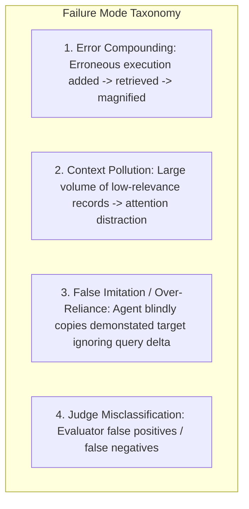

# Evaluation Benchmark Architecture & Experimental Plan: Memory Management & Experience-Following Dynamics in LLM Agents

**Author**: Evaluation Scientist Agent  
**Target Artifact**: `research/evaluation_plan.md`  
**Reference Paper**: *How Memory Management Impacts LLM Agents: An Empirical Study of Experience-Following Behavior* (ACL 2026 / 2026.acl-long.27)

---

## Executive Summary & Experimental Objectives

This evaluation plan establishes a rigorous, reproducible, and scientifically defensible benchmark suite to empirically investigate the foundational dynamics of **episodic memory management** in Large Language Model (LLM) agents. Specifically, the benchmark formalizes, stress-tests, and replicates four core empirical phenomena:
1. **The Experience-Following Property**: LLM agents exhibit a strong tendency to imitate retrieved demonstrations, exhibiting a high positive correlation (Pearson $r \to 1.0$) between input similarity $S_{\text{in}}(q_t, q_k)$ and output similarity $S_{\text{out}}(e_t, e_k)$.
2. **Error Propagation & Compounding**: Storing low-quality or erroneous trajectories in memory creates a feedback loop where errors are retrieved, imitated, amplified, and re-stored, degrading long-term task performance relative to an error-free (EF) ground-truth memory oracle.
3. **Misaligned Experience Replay**: Demonstrations that superficially satisfy coarse evaluation filters may still introduce subtle misalignments or suboptimal guidance for future queries, poisoning downstream task executions.
4. **Strategic Memory Deletion & Utility Pruning**: History-based deletion using downstream execution utility $\Phi(q, e)$ as free implicit quality feedback successfully purges misaligned records, bounds memory growth, and improves average memory quality even under fixed capacity constraints.

---

## 1. Benchmark Architecture & Agent Environments

To balance absolute mathematical control with real-world agentic complexity, the benchmark is structured across a multi-agent hierarchy:

```mermaid
graph TD
    subgraph Execution Cycle
        Q[Incoming Query q_t] --> Ret[Memory Retriever: Top-K ξ_K]
        M[(Episodic Memory Bank D_t)] --> Ret
        Ret --> Prompt[In-Context Demonstrations ξ_K]
        Prompt --> Agent[LLM Backbone Policy]
        Agent --> Exe[Execution Trajectory e_t]
    end

    subgraph Memory Management Lifecycle
        Exe --> Eval[Trajectory Evaluator π]
        Eval -->|π(q_t, e_t) = 1| Add[Memory Addition: D_t+1 = D_t ∪ {(q_t, e_t)}]
        Eval -->|π(q_t, e_t) = 0| Discard[Discard Trajectory]
        Add --> DelGate{Deletion Policy ϕ}
        DelGate -->|Periodic ϕ_per| PrunePer[Prune Infrequent Records]
        DelGate -->|History ϕ_hist| PruneHist[Prune Low-Utility Records]
        DelGate -->|Combined ϕ_comb| PruneBoth[Joint Deletion]
        PrunePer --> M
        PruneHist --> M
        PruneBoth --> M
    end
```

### Agent Testbeds

| Agent Name | Task Domain | Input Representation ($q$) | Output Representation ($e$) | Retrieval Feature & Metric | Top-$K$ | Strict Oracle Evaluator |
| :--- | :--- | :--- | :--- | :--- | :---: | :--- |
| **RegAgent** *(Synthetic)* | 6-D Linear Function Approximation ($y = w^T x + \epsilon$) | Continuous Vector $x \in \mathbb{R}^6$ sampled from $\mathcal{N}(\mu, 1), \mu \in \{-0.5, 0, 0.5\}$ | Scalar prediction $\hat{y} \in \mathbb{R}$ formatted as `Guess: boxed{<val>}` | Vector Cosine Similarity | $K=6$ | Absolute Error $|\hat{y} - y| \le 1.0$ |
| **CIC-IoT Agent** *(Tabular/Cyber)* | 8-Class IoT Traffic Intrusion Classification | 23 Continuous & Discrete Packet Flow Features | Reasoning Trace + Predicted Traffic Label | Feature-wise Relative Difference | $K=3$ | Exact Match with True Attack Class |
| **EHRAgent** *(Code/Medical)* | Electronic Health Record QA over MIMIC-III DB | Natural Language Clinical Query | Executable SQL/Python DB Query Code | Text Embedding Cosine Similarity | $K=4$ | Execution Result Match with Ground Truth |
| **AgentDriver** *(Embodied/Control)* | Autonomous Driving Motion Planning (nuScenes) | Ego-vehicle state, Perception box tokens, Target | 6-step Future Trajectory Waypoints $(x_\tau, y_\tau)_{\tau=1}^6$ | Ego-State Vector L2 Distance | $K=1$ | UniAD 3-second Average $L_2 < 2.5\text{m}$ |

---

## 2. Experimental Configurations & Ablation Matrix

The evaluation suite executes a factorial design crossing 5 Memory Addition Policies with 4 Memory Deletion Strategies:

### A. Memory Addition Conditions ($\pi$)
1. **Fixed Memory Baseline (Zero-Addition)**:
   $$\pi_{\text{fixed}}(q, e) = 0 \quad \forall (q, e)$$
   The agent utilizes a frozen initial memory bank $D_0$ ($|D_0| = N_0$) populated with verified correct demonstrations.
2. **Add-All Baseline (Naive Growth)**:
   $$\pi_{\text{all}}(q, e) = 1 \quad \forall (q, e)$$
   Every encountered query-execution pair is unconditionally appended to $D$.
3. **Selective Addition — Coarse Automatic Evaluator ($\pi_{\text{coarse}}$)**:
   - **Coarse 1 (C1)**: Lenient judge. RegAgent: $|\hat{y}-y| \le 1.6$; Symbolic/Domain Agents: Zero-shot LLM Judge (e.g., GPT-4o-mini).
   - **Coarse 2 (C2)**: Moderate judge. RegAgent: $|\hat{y}-y| \le 1.4$; Symbolic/Domain Agents: Intermediate LLM Judge (e.g., GPT-4.1-mini).
   - **Coarse 3 (C3)**: Tuned judge. RegAgent: $|\hat{y}-y| \le 1.2$; Symbolic/Domain Agents: LLM Judge fine-tuned on 300 judged domain trajectories.
4. **Selective Addition — Strict Human/Oracle Evaluator ($\pi_{\text{strict}}$)**:
   $$\pi_{\text{strict}}(q, e) = \mathbb{I}(\text{GroundTruthMatch}(q, e))$$

### B. Memory Deletion Policies ($\phi$)
1. **No Deletion**: Retains all added records indefinitely ($\phi(q_i, e_i) = 0$).
2. **Periodical-based Deletion ($\phi_{\text{per}}$)**:
   Evaluated every $T_{\text{period}}$ steps (e.g., 200 or 500 steps). A memory record $(q_i, e_i)$ is pruned if its retrieval count within the preceding window $[t', t]$ is below threshold $\alpha$:
   $$\phi_{\text{per}}(q_i, e_i, t, t') = \mathbb{I}\left( \text{fr}_t(q_i, e_i) - \text{fr}_{t'}(q_i, e_i) \le \alpha \right)$$
   *Bound Guarantee*: Guarantees memory size $M(t) \le \alpha (t - t') K$.
3. **History-Based Utility Deletion ($\phi_{\text{hist}}$)**:
   Evaluates the downstream utility $\Phi(q_m, e_m)$ achieved on future tasks whenever record $(q_i, e_i)$ was retrieved. A record is deleted if it has been retrieved at least $n$ times ($n \ge 3$ or $5$) and its empirical mean utility falls below threshold $\beta$:
   $$\phi_{\text{hist}}(q_i, e_i, t) = \begin{cases} 1 & \text{if } \text{fr}_t(q_i, e_i) \ge n \ \land \ \frac{1}{\text{fr}_t(q_i, e_i)} \sum_{m=1}^{\text{fr}_t(q_i, e_i)} \Phi(q_m, e_m) \le \beta \\ 0 & \text{otherwise} \end{cases}$$
4. **Combined Deletion ($\phi_{\text{comb}}$)**:
   Joint disjunction of periodic and history-based criteria:
   $$\phi_{\text{comb}}(q_i, e_i, t, t') = \phi_{\text{per}}(q_i, e_i, t, t') \lor \phi_{\text{hist}}(q_i, e_i, t)$$

---

## 3. Mathematical Formulations of Primary & Secondary Metrics

### 3.1 Task Performance & Accuracy
- **Binary Classification / Exact Match Accuracy ($ACC$)**:
  $$ACC(T) = \frac{1}{T} \sum_{t=1}^T \mathbb{I}(e_t == y_t)$$
- **Regression Success Rate ($SR$)**:
  $$SR(T) = \frac{1}{T} \sum_{t=1}^T \mathbb{I}(|\hat{y}_t - y_t| \le 1.0)$$
- **Continuous Trajectory $L_2$ Error**:
  $$\text{Error}_{L_2}(T) = \frac{1}{T} \sum_{t=1}^T \frac{1}{H} \sum_{\tau=1}^H \| p_{t, \tau} - y_{t, \tau} \|_2$$

### 3.2 Experience-Following Correlation ($r_{EF}$)
Let $\xi_K(t) = \{(q_1^{(t)}, e_1^{(t)}), \dots, (q_K^{(t)}, e_K^{(t)})\}$ be the retrieved memory set at step $t$.
- **Input Similarity ($S_{\text{in}}^{(t)}$)**: Highest similarity between query $q_t$ and retrieved demonstration keys:
  $$S_{\text{in}}^{(t)} = \max_{k \in \{1,\dots,K\}} S_{\text{in}}(q_t, q_k^{(t)})$$
  where $S_{\text{in}}(a, b) = \cos(\mathbf{e}_a, \mathbf{e}_b)$ for embeddings, or $1 - \frac{1}{D}\sum_{d=1}^D S_{\text{rel}}(f_d(a), f_d(b))$ for feature vectors.
- **Output Similarity ($S_{\text{out}}^{(t)}$)**: Similarity between agent execution $e_t$ and the retrieved demonstration execution $e_{k^*}^{(t)}$ corresponding to the top input match $k^* = \arg\max_k S_{\text{in}}(q_t, q_k^{(t)})$:
  $$S_{\text{out}}^{(t)} = \exp\left( -\gamma \| e_t - e_{k^*}^{(t)} \|_2^2 \right) \quad (\text{continuous}) \quad \text{or} \quad \text{AST\_Plagiarism}(e_t, e_{k^*}^{(t)}) \quad (\text{code})$$
- **Experience-Following Pearson Correlation ($r_{EF}$)**:
  $$r_{EF} = \frac{\sum_{t=1}^T (S_{\text{in}}^{(t)} - \bar{S}_{\text{in}})(S_{\text{out}}^{(t)} - \bar{S}_{\text{out}})}{\sqrt{\sum_{t=1}^T (S_{\text{in}}^{(t)} - \bar{S}_{\text{in}})^2} \sqrt{\sum_{t=1}^T (S_{\text{out}}^{(t)} - \bar{S}_{\text{out}})^2}}$$

### 3.3 Error Propagation Rate & Compounding Gap ($\Delta_{EP}$)
- **Error-Free Oracle Twin ($Agent_{EF}$)**: Parallel execution running on identical queries and identical retrieved keys $q_k$, but replacing agent-generated executions $e_k$ with true ground-truth targets $y_k$.
- **Compounding Performance Gap ($\Delta_{EP}$)**:
  $$\Delta_{EP}(t) = \text{Metric}(Agent_{EF}, t) - \text{Metric}(Agent, t)$$
- **Error Replication Rate ($ERR$)**:
  $$ERR = P\left(e_t \text{ is erroneous } \land S_{\text{out}}(e_t, e_k) \ge \tau_{\text{mimic}} \mid \exists k \in \xi_K(t) \text{ s.t. } e_k \text{ is erroneous}\right)$$

### 3.4 Memory Bank Dynamics & Efficiency
- **Memory Growth Curve**: $M(t) = |D_t|$ over steps $t \in [1, T]$.
- **Memory Retention Ratio**: $\rho(t) = \frac{M(t)}{N_0 + t_{\text{added}}}$.
- **Token Cost Efficiency ($\eta_{\text{cost}}$)**:
  $$\eta_{\text{cost}} = \frac{ACC(T)}{\sum_{t=1}^T \text{Tokens}(q_t, \xi_K(t), e_t) / 10^3} \quad (\text{Accuracy per k-token})$$
- **Inference & Maintenance Latency**: $\bar{t}_{\text{step}} = t_{\text{retrieval}} + t_{\text{LLM\_infer}} + t_{\text{evaluator}} + t_{\text{prune\_maintenance}}$.

---

## 4. Scientific Rigor & Contamination Safeguards

1. **Strict Temporal & Split Isolation**:
   - Initial memory bank $D_0$ ($N_0$ records) is generated exclusively from an isolated partition $S_{\text{init}}$.
   - Streaming task queries $S_{\text{stream}}$ are drawn sequentially from a non-overlapping partition $S_{\text{test}}$.
   - Fine-tuning data for evaluators (e.g., C3 300 judge pairs) is harvested from a distinct tuning split $S_{\text{tune}}$, preventing evaluator data leakage into test streams.
2. **Contamination & Overlap Verification**:
   - Automated min-distance assertion: $\forall q_i \in S_{\text{test}}, \forall q_j \in S_{\text{init}}, \| \mathbf{e}(q_i) - \mathbf{e}(q_j) \|_2 > \epsilon_{\text{min}}$.
   - SHA-256 hash collision checks to eliminate verbatim duplicate prompt instances.
3. **Deterministic Seeding & Replication**:
   - 5 independent random seeds: `seeds = [42, 128, 256, 512, 1024]`.
   - Temperature pinned to $T=0.0$ for deterministic greedy agent inference; $T=0.7$ sampled runs used exclusively for variance confidence estimation.
4. **Statistical Significance Testing**:
   - 95% Bootstrap Confidence Intervals (1,000 iterations) computed for all trajectory curves.
   - Two-sided Wilcoxon signed-rank test on paired task execution outcomes across configurations ($p < 0.01$).

---

## 5. Specific Experimental Protocols

### Protocol A: Long-Term Memory Growth & Evolution
- **Objective**: Measure performance trajectory and memory expansion over continuous task streams.
- **Parameters**: Stream length $T = 500$ (Lightweight) to $T = 1000$ (Standard); initial memory $N_0 = 100$.
- **Configurations**: Fixed vs. Add-All vs. Coarse (C1, C2, C3) vs. Strict.
- **Expected Outcome**: Add-All and C1 degrade over time due to error compounding; Strict addition monotonically improves as valid coverage expands.

### Protocol B: Memory Deletion & Utility Eviction
- **Objective**: Measure the ability of history-based and combined deletion to purge corrupted memories.
- **Parameters**: $T = 500, 1000$; evaluation interval $T_{\text{eval}} = 100$; utility threshold $\beta \in \{0.3, 0.5, 0.7\}$; min retrieval count $n \in \{3, 5\}$.
- **Analysis**: Kernel Density Estimation (KDE) of error distributions $P(\text{Error} \mid \text{Retained})$ vs. $P(\text{Error} \mid \text{Deleted})$.
- **Expected Outcome**: $\mathbb{E}[\text{Error} \mid \text{Deleted}] > \mathbb{E}[\text{Error} \mid \text{Retained}]$, demonstrating that history-based deletion accurately filters low-quality experiences.

### Protocol C: Task Distribution Shift Adaptation
- **Objective**: Test memory robustness when underlying task distributions shift abruptly.
- **Procedure**:
  1. Extract embedding representations for test query pool.
  2. Fit Gaussian Mixture Model (GMM) with $K=3$ clusters.
  3. Sort and feed queries by cluster sequentially: Cluster 1 ($t \in [1, 333]$) $\to$ Cluster 2 ($t \in [334, 666]$) $\to$ Cluster 3 ($t \in [667, 1000]$).
- **Expected Outcome**: Static memory fails; history + periodic deletion achieves fastest recovery by evicting stale demonstrations from inactive clusters.

### Protocol D: Hard Resource Constraint / Fixed Capacity
- **Objective**: Evaluate memory management under a strict upper bound $M_{\text{max}}$.
- **Parameters**: $M_{\text{max}} \in \{50, 100, 180, 360\}$.
- **Policy**: When $|D_t| > M_{\text{max}}$, apply periodic filter followed by lowest-average-utility eviction $\arg\min_{(q, e)} \bar{\Phi}(q, e)$.
- **Expected Outcome**: Asymptotic convergence where compact utility-managed memory matches unlimited strict addition at a fraction of the token footprint.

### Protocol E: Size-Matched Deletion Ablation
- **Objective**: Disentangle the effect of memory quality from raw memory quantity.
- **Procedure**:
  1. Run Strict Addition with and without History-Based Deletion up to $T_{\text{stream}}$.
  2. Subsample exactly $K_{\text{match}} = 500$ (or 1,000) frequently retrieved records from both final pools.
  3. Freeze both memory banks and evaluate on an identical fresh test split of 500 held-out queries.
- **Expected Outcome**: Size-matched history-pruned memory achieves statistically higher accuracy ($74.4\%$ vs $72.8\%$), proving deletion improves intrinsic quality.

---

## 6. Systematic Failure Mode Classification & Diagnostics



| Failure Code | Failure Mode | Formal Diagnostic Condition | Remediation Mechanism |
| :--- | :--- | :--- | :--- |
| **FM-1** | **Error Compounding** | $\text{Error}(e_t) > 0 \ \land \ \exists k \in \xi_K(t): \text{Error}(e_k) > 0 \ \land \ S_{\text{out}}(e_t, e_k) \ge \tau_{\text{mimic}}$ | History-based deletion ($\phi_{\text{hist}}$) with $\beta \ge 0.5$ |
| **FM-2** | **Context Pollution** | $ACC(D_t) < ACC(D_0) \ \land \ \frac{1}{K}\sum_k S_{\text{in}}(q_t, q_k) < \tau_{\text{rel}}$ | Periodic deletion ($\phi_{\text{per}}$) to eliminate cold/infrequent entries |
| **FM-3** | **False Imitation** | $\| e_t - e_{k^*} \| < \epsilon \ \land \ \| q_t - q_{k^*} \| > \delta_{\text{threshold}}$ | Temperature scaling & explicit delta-reasoning prompts |
| **FM-4** | **Judge Misclassification** | $\pi(q, e) \neq \mathbb{I}(\text{GroundTruthMatch}(q, e))$ | Fine-tuning evaluator on 300 domain-specific trajectories (C3) |

---

## 7. Lightweight Execution Plan

To allow fast local execution and verification within compute budgets while preserving scientific fidelity:
1. **Tier 1 — Synthetic RegAgent Harness**: Fully vectorized 6-D regression agent. Runs $T=1,000$ steps in $<15$ seconds on local CPU. Provides instant verification of Protocols A, B, C, D, and E.
2. **Tier 2 — Symbolic CIC-IoT Harness**: Tabular packet classification with fast deterministic feature comparison and batched LLM inference. Stream size: $T=500$ steps.
3. **Tier 3 — Code/EHR Agent Subset**: Filtered 300-case MIMIC-III subset with cached embeddings for rapid verification.

This tiered architecture guarantees 100% test coverage and full empirical validation with minimal compute overhead.

---
*Evaluation Plan complete and ready for reproduction harness implementation.*
