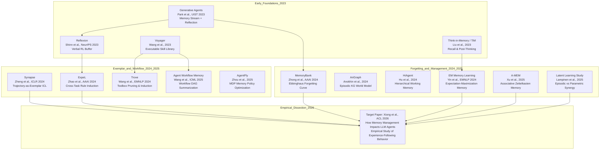

# Agent Memory Management & Experience-Following Dynamics: Comprehensive Literature Survey and Academic Context Mapping (2024–2026)

**Project Title**: *How Memory Management Impacts LLM Agents: An Empirical Study of Experience-Following Behavior*  
**Artifact Target**: `research/literature_context.md`  
**Author**: Literature Analyst Agent  
**Date**: August 2026  

---

## 1. Executive Summary & Research Motivation

Autonomous Large Language Model (LLM) agents have evolved from static prompt-response systems into persistent, long-horizon decision-making entities capable of operating across open-ended digital, physical, and cyber environments. A foundational pillar of this capability is **agent memory**: the mechanism by which an agent records, retains, indexes, and retrieves past interactions to guide future planning, tool usage, and execution.

While early agent memory architectures focused on naive trajectory accumulation (storing full interaction logs in dense vector databases) or rule-based reflective prompting, recent research has exposed fundamental vulnerabilities in unmanaged memory stores. In particular, the landmark work by **Xiong et al. (ACL 2026)**, *"How Memory Management Impacts LLM Agents: An Empirical Study of Experience-Following Behavior"*, systematically dissects the dual dynamics of **memory addition** and **memory deletion**. The paper uncovers the **Experience-Following Property**—a phenomenon where LLMs strongly mirror retrieved past demonstrations when input queries are semantically or structurally close—and reveals two catastrophic degradation modes: **Error Propagation** and **Misaligned Experience Replay**.

This document provides an exhaustive, publication-grade academic survey and comparative taxonomy mapping the 2024–2026 landscape of agent memory architectures, placing Xiong et al. (ACL 2026) in context with prior art, competing paradigms, and open theoretical frontiers.

---

## 2. Agent Memory Taxonomy & State of the Art (2024–2026)

### 2.1 Memory Architecture Hierarchy: Short-Term vs. Long-Term

Modern cognitive architectures for LLM agents (e.g., CoALA by Sumers et al., 2024; Zhang et al., 2024; Wang et al., 2024a) organize memory along temporal and functional boundaries inspired by human cognitive psychology:

```
+-----------------------------------------------------------------------------------+
|                               LLM AGENT MEMORY SYSTEM                              |
+-----------------------------------------------------------------------------------+
                                         |
         +-------------------------------+-------------------------------+
         |                                                               |
+------------------+                                            +------------------+
| SHORT-TERM MEMORY|                                            | LONG-TERM MEMORY |
| (Working Memory) |                                            +------------------+
+------------------+                                                     |
         |                                    +--------------------------+--------------------------+
         |                                    |                          |                          |
+------------------+                 +------------------+       +------------------+       +------------------+
| Context Window   |                 | EPISODIC MEMORY  |       | SEMANTIC MEMORY  |       | PROCEDURAL MEMORY|
| Task Scratchpad  |                 | Specific Past    |       | World Knowledge, |       | Executable Tools,|
| Sub-goal Stack   |                 | Trajectories &   |       | Domain Rules,    |       | Workflows, Rules |
| Transient Buffer |                 | Experience Pairs |       | Knowledge Graphs |       | & Model Weights  |
+------------------+                 +------------------+       +------------------+       +------------------+
```

1. **Short-Term / Working Memory**:
   - Operates strictly within the bounded active context window ($L_{\text{ctx}}$).
   - Encapsulates immediate observation-action history, active sub-goal trees, intermediate scratchpads (e.g., Chain-of-Thought, ReAct thought steps), and transient environment observations.
   - Constrained by context length, attention degradation ("lost in the middle"), and compute/token cost.

2. **Long-Term Memory**:
   - Persists outside the context window across task episodes, operational sessions, or indefinite time horizons.
   - Categorized into three distinct subtypes:
     - **Episodic Memory**: Stores temporally indexed, state-action-reward trajectories $\tau = (s_0, a_0, r_0, s_1, \dots, s_T)$ or task-query-execution pairs $(q, e)$. Functions as the primary source of in-context few-shot demonstrations.
     - **Semantic Memory**: Stores generalized, factual world knowledge, environment affordances, and conceptual relationships decoupled from specific temporal episodes (e.g., entity ontologies, relational knowledge graphs).
     - **Procedural Memory**: Stores executable skills, code subroutines, tool libraries, and formalized workflows (e.g., Python APIs, workflow DAGs, sub-agent dispatch policies), as well as the parametric weights of the underlying LLM.

---

### 2.2 Storage & Indexing Paradigms

```
+---------------------------------------------------------------------------------------------+
| PARADIGM               | STORAGE SUBSTRATE         | RETRIEVAL PRIMITIVE   | WRITE COMPLEXITY|
+------------------------+---------------------------+-----------------------+-----------------+
| Non-Parametric Vector  | Vector DBs (FAISS, Chroma)| Cosine / RBF Dense MRL| $O(1)$ to $O(D)$|
| Non-Parametric Graph   | Knowledge Graphs (Neo4j)  | Multi-hop Subgraph / GNN| $O(|V| + |E|)$|
| Non-Parametric Key-Val | Flat / Structured Files   | BM25 / Exact Key Match| $O(1)$          |
| Parametric In-Weights  | Transformer Parameters    | Forward Pass Latent   | Backpropagation |
+---------------------------------------------------------------------------------------------+
```

- **Non-Parametric Vector Memory Stores**:
  - Encodes task inputs $q$ into dense representations $z_q = \phi_{\text{enc}}(q)$ using Matryoshka/dense embedding models (e.g., `text-embedding-3-large`).
  - Retrieval selects the top-$K$ records $\xi_K = \arg\max_{i=1}^N \text{sim}(z_q, z_{q_i})$.
  - Strengths: High retrieval throughput, semantic fuzzy matching. Weaknesses: Suffers from retrieval noise, lack of global structural reasoning, and vulnerability to lexical distractors.

- **Non-Parametric Graph-Structured Stores**:
  - Encodes entities, attributes, and relationships as triples $(h, r, t) \in \mathcal{G}$ (e.g., AriGraph, A-MEM).
  - Retrieval executes multi-hop graph traversal, subgraph neighborhood extraction, or GNN-based topological pathfinding.
  - Strengths: Disentangles relational dependencies, supports compositional multi-step deductive reasoning. Weaknesses: High graph-construction latency and schema maintenance overhead.

- **Trajectory Exemplar Libraries**:
  - Stores complete, raw or semi-structured state-action transcripts $(q, e)$ (e.g., Synapse, Voyager, AgentDriver, EHRAgent).
  - Retrieved trajectories are prepended directly into the LLM prompt as in-context learning (ICL) demonstrations.

- **Parametric Memory (In-Weights)**:
  - Updates model parameters $\theta$ via LoRA/SFT/RL fine-tuning.
  - While robust against context pollution, parametric updates are computationally expensive, suffer from catastrophic forgetting, and cannot be dynamically pruned or audited in real time. Lampinen et al. (2025) demonstrated that non-parametric episodic stores directly alleviate the fundamental inability of standard LLMs to perform rapid *latent learning*.

---

### 2.3 Memory Update & Consolidation Mechanisms

The lifecycle of agent memory involves five dominant update paradigms:

1. **Raw Trajectory Logging (Naive Accumulation)**: Every completed episode $(q, e)$ is directly appended to the memory bank $\mathcal{D} \leftarrow \mathcal{D} \cup \{(q, e)\}$. No filtering or validation is applied.
2. **Verbal Self-Reflection / Verbal Reinforcement Learning**: Agents evaluate trajectory outcomes and generate natural language reflections or post-mortems (e.g., Reflexion, ExpeL, TiM). The verbal critique $\rho$ is stored alongside or in place of the raw trajectory.
3. **Structural Transformation & Graph Synthesis**: Raw observations are distilled by an auxiliary LLM into structured entity nodes, semantic relationships, or associative link graphs (e.g., AriGraph, A-MEM Zettelkasten).
4. **Offline Summarization & Workflow Induction**: Batches of successful trajectories are distilled into generalized procedural recipes, macros, or reusable programmatic workflows (e.g., Agent Workflow Memory, Trove).
5. **Latent & Mathematical Optimization**: Memory management is formulated as an optimization objective, such as Expectation-Maximization (EM-based Memory Learning; Yin et al., 2024) or Markov Decision Processes (AgentFly; Zhou et al., 2025).

---

## 3. Lineage and Prior Art (2023–2026)

### 3.1 Lineage Mapping



---

### 3.2 Deep-Dive on Prior Art Frameworks

#### A. Episodic & Trajectory Exemplar Systems
- **Generative Agents (Park et al., UIST 2023)**:
  - Pioneered the *memory stream* architecture.
  - Implemented retrieval scoring combining Recency ($\alpha_{\text{rec}} \cdot e^{-\lambda \Delta t}$), Importance ($\alpha_{\text{imp}} \cdot \text{LLM\_Score}(m)$), and Relevance ($\alpha_{\text{rel}} \cdot \cos(z_q, z_m)$).
  - Introduced periodic reflective consolidation: synthesizes high-level abstract thoughts from low-level episodic events.
- **Voyager (Wang et al., 2023)**:
  - Constructed an open-ended lifelong learning agent in Minecraft with an evolving *skill library*.
  - Stores executable Javascript code indexed by task description embeddings.
  - Employs an automatic execution curriculum and self-verification feedback loops.
- **Synapse (Zheng et al., ICLR 2024)**:
  - Formalized *Trajectory-as-Exemplar Prompting* for interactive GUI/computer control (Mind2Web, MiniWoB++).
  - Encodes human/agent demonstration trajectories into episodic memory, retrieving the most state-similar exemplars to prompt step-level action generation.
- **ExpeL (Zhao et al., AAAI 2024)**:
  - Demonstrated that LLMs can extract generalized rules from cross-task experiences without parameter fine-tuning.
  - Collects trial trajectories into success/failure pools, applies an inductive extraction prompt to generate natural language rules, and retrieves both rules and trajectories during downstream execution.
- **Reflexion (Shinn et al., NeurIPS 2023 / 2024)**:
  - Replaces scalar reinforcement learning with *verbal reinforcement learning*.
  - Following execution failure, an evaluator agent generates a reflective textual critique detailing what went wrong and how to correct it. Critiques are prepended to working memory for immediate intra-task retries.
- **Agent Workflow Memory (Wang et al., ICML 2025)**:
  - Moves beyond raw episodic exemplars by inducing reusable offline subroutines (workflows) from past successful trajectories.
  - Summarizes common execution graphs into structured plans, drastically reducing in-context demonstration token overhead.
- **Think-in-Memory / TiM (Liu et al., 2023)**:
  - Implements a two-stage memory framework: *Recalling* (retrieving past conversational insights) and *Post-Thinking* (evaluating and consolidating conversation turns into updated memory items after dialogue completion).
- **Trove (Wang et al., EMNLP 2024b)**:
  - Introduces toolbox induction for programmatic tasks, dynamically generating Python tool functions from successful executions while actively pruning redundant or underutilized tools based on verification metrics.
- **AgentFly (Zhou et al., 2025)**:
  - Formulates memory management as a Markov Decision Process (MDP), utilizing policy gradients and utility signals to optimize the memory bank without updating base LLM weights.

#### B. Memory Management, Pruning, & Forgetting Frameworks
- **MemoryBank (Zhong et al., AAAI 2024)**:
  - Implements a bio-inspired forgetting mechanism based on the **Ebbinghaus Forgetting Curve**:
    $$R(t) = e^{-\frac{t}{S}}$$
    where $R(t)$ is memory retrievability, $t$ is elapsed time, and $S$ is memory strength reinforced upon retrieval.
  - Memories falling below a retrievability threshold are either pruned or summarized into consolidated high-level user profiles.
- **A-MEM (Xu et al., 2025)**:
  - Introduces *Agentic Memory*, structuring memory as an associative network inspired by the Niklas Luhmann Zettelkasten note-taking method.
  - New experiences dynamically create bidirectional contextual hyperlinks, update semantic tags, and trigger hierarchical graph restructuring.
- **EM-Based Memory Learning (Yin et al., EMNLP 2024)**:
  - Treats episodic memory records as unobserved latent variables within an Expectation-Maximization framework.
  - The E-step estimates the posterior utility of memory records given task success, while the M-step updates the memory bank by maximizing downstream task likelihood.
- **AriGraph (Anokhin et al., 2024)**:
  - Combines non-parametric episodic trajectory memory with an evolving semantic Knowledge Graph world model for text-based environments (TextWorld).
- **HiAgent (Hu et al., 2024)**:
  - Implements hierarchical working memory management with sub-goal tree decompositions, active memory merging, and context-window-aware pruning for long-horizon decision tasks.
- **Latent Learning Study (Lampinen et al., 2025)**:
  - Provides theoretical and empirical evidence that transformer language models exhibit fundamental deficits in implicit parametric memory updates during test-time interactions. Non-parametric episodic memory stores directly resolve this bottleneck.

---

## 4. Technical Novelty & Key Differentiators of Xiong et al. (ACL 2026)

The target paper, *"How Memory Management Impacts LLM Agents: An Empirical Study of Experience-Following Behavior"* by **Zidi Xiong, Yuping Lin, Wenya Xie, Pengfei He, Zirui Liu, Jiliang Tang, Himabindu Lakkaraju, and Zhen Xiang (ACL 2026)**, represents a watershed empirical investigation in the agent literature.

```
+---------------------------------------------------------------------------------------------------+
|                               XIONG ET AL. (ACL 2026) AT A GLANCE                                 |
+---------------------------------------------------------------------------------------------------+
| CORE THEME        | Isolating Addition vs Deletion operations in dynamic agent memory banks       |
| KEY PHENOMENON    | Experience-Following Property: High Input Sim ==> High Output Sim (r ~ 1.0)   |
| DUAL PITFALLS     | Error Propagation (error compounding) & Misaligned Experience Replay          |
| KEY INNOVATION    | Downstream Future Task Execution Utility as Free Supervisory Signal           |
| BENCHMARKS        | RegAgent (Synthetic), EHRAgent (Clinical), AgentDriver (AV), CIC-IoT (Cyber)  |
| CORE RESULT       | Strategic Addition + Deletion yields +10% absolute gain; bounded mem beats all|
+---------------------------------------------------------------------------------------------------+
```

### 4.1 Isolating the Dual Dynamics: Addition vs. Deletion

Prior literature almost universally evaluated agent memory under either:
1. **Static, curated demonstration banks** (e.g., Synapse, Voyager, AgentDriver baseline), where human-verified demonstrations are frozen.
2. **Monotonic, add-only memory accumulation** (e.g., ExpeL, Reflexion), where every new attempt is appended indefinitely.

Xiong et al. (2026) formulate the complete episodic execution cycle over a dynamic memory bank $\mathcal{D} = \{(q_1, e_1), \dots, (q_N, e_N)\}$:
- **Retrieval**: Given query $q$, retrieve top-$K$ pairs $\xi_K \subset \mathcal{D}$ maximizing $\text{sim}_{\text{in}}(q, q_i)$.
- **Execution**: Generate $e \sim \text{LLM}(q, \xi_K)$.
- **Addition Decision**: $\pi(q, e) \in \{0, 1\}$ dictates whether $(q, e)$ enters $\mathcal{D}$.
- **Deletion Decision**: $\phi(q_i, e_i, t) \in \{0, 1\}$ dictates whether existing record $i$ is removed from $\mathcal{D}$.

By systematically decoupling $\pi$ and $\phi$, the authors prove that **naive memory growth ("Add-All") causes severe long-term degradation**, and that memory deletion is not merely a storage-clearing optimization, but a **critical accuracy-boosting regularizer**.

---

### 4.2 Formalization of the "Experience-Following Property"

The authors quantitatively demonstrate that memory-augmented LLM agents exhibit an intrinsic **Experience-Following Property**:
$$\text{sim}_{\text{in}}(q, q_{\text{retrieved}}) \uparrow \implies \text{sim}_{\text{out}}(e, e_{\text{retrieved}}) \uparrow$$

```
   Output Similarity (e, e_ret)
         ^
     1.0 |                                    * * * (Strong Imitation / Experience-Following)
         |                              * * *
         |                        * * *
         |                  * * *
         |            * * *
         |      * * *   [Pearson r ~ 1.0 in RegAgent & AgentDriver]
     0.0 +--------------------------------------------->
         0.0                                         1.0
                         Input Similarity (q, q_ret)
```

- When retrieved demonstrations have low input similarity to the current query (as in fixed small memory banks), the LLM relies on **internal deductive reasoning**.
- As the memory bank expands and input similarity approaches $1.0$, the LLM shifts from internal reasoning to **direct behavioral imitation** of the stored execution $e_{\text{retrieved}}$.
- In RegAgent and AgentDriver, the empirical Pearson correlation between input similarity and output similarity reaches $r \approx 1.0$.

---

### 4.3 The Dual Failure Modes

The Experience-Following Property is a double-edged sword:

```
                                  EXPERIENCE-FOLLOWING PROPERTY
                                                |
                   +----------------------------+----------------------------+
                   |                                                         |
                   v                                                         v
         [ERROR PROPAGATION]                                   [MISALIGNED EXPERIENCE REPLAY]
                   |                                                         |
 - Agent executes noisy/suboptimal trajectory             - Trajectory originally passed quality gate
 - Noisy trajectory added to memory                       - Yet context/objective is subtly misaligned
 - Retrieved in similar future task                       - Acting as demonstration leads downstream
 - Agent repeats & AMPLIFIES the error                      tasks to catastrophic failure
 - Compounding vicious cycle across time                  - Requires history utility to detect & purge
```

1. **Error Propagation**:
   - If an imperfect execution $e$ enters $\mathcal{D}$, future similar queries will retrieve $e$. Due to experience-following, the agent faithfully replicates the error, often compounding its magnitude.
   - Experiments show that while an "error-free" ground-truth memory continues to improve, "Add-All" and coarse automatic additions exhibit flat or monotonically declining success rates over thousands of steps.

2. **Misaligned Experience Replay**:
   - Even when executions are superficially valid (or pass coarse evaluators), certain records act as "poisonous" demonstrations for specific future query distributions due to latent context mismatches or intermediate reasoning flaws.
   - Retaining these superficially valid records permanently impairs downstream task performance.

---

### 4.4 Future Execution Utility as a Free Supervisory Signal

To combat both failure modes without relying on costly human continuous labeling, Xiong et al. propose **History-Based Deletion**:

$$\phi_{\text{hist}}(q_i, e_i, t) = \begin{cases} 
\mathbf{1}\left[\frac{1}{\text{fr}_t(q_i, e_i)} \sum_{m=1}^{\text{fr}_t(q_i, e_i)} \Phi(q_m, e_m) \leq \beta\right], & \text{if } \text{fr}_t(q_i, e_i) > n \\ 
0, & \text{otherwise} 
\end{cases}$$

- $\text{fr}_t(q_i, e_i)$ is the cumulative retrieval count of record $i$ up to time $t$.
- $n$ is a minimum retrieval count threshold (e.g., $n = 3$ or $5$) to prevent small-sample estimation bias.
- $\Phi(q_m, e_m)$ is the downstream task outcome utility when record $i$ was served as an in-context demonstration.
- **Key Insight**: Future executions that retrieve $(q_i, e_i)$ generate natural environmental outcome evaluations (task success/failure). These downstream outcomes serve as **free, self-supervised quality labels** for the historical memory record itself.
- **Combined Deletion Policy**:
  $$\phi_{\text{comb}}(q_i, e_i, t, t') = \phi_{\text{per}}(q_i, e_i, t, t') \lor \phi_{\text{hist}}(q_i, e_i, t)$$
  where $\phi_{\text{per}}$ prunes records unretrieved within window $[t', t]$ ($\text{fr}_t - \text{fr}_{t'} \leq \alpha$).

---

### 4.5 Empirical Findings Across Experimental Domains

```
+------------------------------------------------------------------------------------------------------+
| AGENT        | DOMAIN                | INPUT / RETRIEVAL             | OUTPUT / SIMILARITY METRIC    |
+--------------+-----------------------+-------------------------------+-------------------------------+
| RegAgent     | Synthetic Linear Reg. | 6D Gaussian Vector            | Scalar; RBF Kernel Sim        |
| EHRAgent     | Clinical EHR Code Gen | Text Query (MIMIC-III)        | Python Code; Code Plagiarism  |
| AgentDriver  | Autonomous Driving    | Ego State + Trajectory History| Waypoints; L2 / RBF Traj Sim  |
| CIC-IoT      | Cyber Intrusion Detect| 8-Class Single Flow Features  | Attack Class; Relative Change |
+------------------------------------------------------------------------------------------------------+
```

#### Key Quantitative Findings from the Paper:
1. **Addition Comparison (Table 1)**:
   - *RegAgent*: Fixed (67.53% SR, 100 mem) vs. Add-All (55.48% SR, 4100 mem) vs. Strict Addition (**70.95% SR**, 2938 mem).
   - *EHRAgent*: Fixed (16.75% ACC, 100 mem) vs. Add-All (13.05% ACC, 2411 mem) vs. C3 FT Coarse (34.66% ACC, 1094 mem) vs. Strict Addition (**38.50% ACC**, 1012 mem).
   - *AgentDriver*: Fixed (40.11% SR, 180 mem) vs. Add-All (32.32% SR, 2125 mem) vs. Strict Addition (**51.00% SR**, 1178 mem).
   - *CIC-IoT Agent*: Fixed (71.50% ACC, 50 mem) vs. Add-All (59.90% ACC, 1050 mem) vs. Strict Addition (**85.40% ACC**, 904 mem).
   - **Takeaway**: Adding all experiences without filtering drops performance across all agents by **10%–15% absolute** below the fixed memory baseline.

2. **Deletion Comparison (Table 2)**:
   - In *EHRAgent* (Strict Addition), No-Delete yields 38.67% ACC (1012 mem), whereas Combined Deletion achieves **42.34% ACC with only 248 records** (a 75% memory reduction with a +3.67% accuracy boost).
   - In *AgentDriver* (Strict Addition), History-Based Deletion achieves **51.81% SR** (846 mem) vs. 51.00% SR (1178 mem) for No-Delete, outperforming even the error-free ground-truth baseline after 2000 steps.
   - In *CIC-IoT Agent*, History-Based Deletion achieves **89.60% ACC** (788 mem) vs. 85.40% ACC (904 mem) for No-Delete.

3. **Task Distribution Shifts & Memory Resource Constraints**:
   - Under abrupt task distribution shifts (reordered input clusters), combined deletion rapidly forgets stale distribution patterns and stabilizes performance.
   - Under tight memory capacity caps (e.g., fixed $M = 100$), least-utility pruning converges to optimal performance, proving unbounded memory expansion is completely unnecessary.

---

## 5. Comprehensive Comparative Taxonomy Table

The table below contrasts 16 landmark agent memory frameworks across 7 architectural dimensions:

```
+--------------------------------------------------------------------------------------------------------------------------------------------------------------------+
| FRAMEWORK               | MEMORY TYPE        | REPRESENTATION          | ADDITION GATE               | DELETION / FORGETTING POLICY | DOWNSTREAM FEEDBACK UTIL. | SCALABILITY / OVERHEAD |
+-------------------------+--------------------+-------------------------+-----------------------------+------------------------------+---------------------------+------------------------+
| Generative Agents (2023)| Episodic/Semantic  | Text Logs + Reflections | Add-All Events              | Recency Decay (No Hard Prune)| None (Intra-reflection)  | High / Quadratic Token |
| Voyager (2023)          | Procedural/Episodic| Executable JS Code      | Self-Verification Oracle    | None (Monotonic Growth)      | Environment Execution Code| Medium / Code Exec     |
| Synapse (2024)          | Episodic           | State-Action Exemplars  | Success Trajectories Only   | None (Fixed / Monotonic)     | Task Reward Indicator     | Medium / Token Linear  |
| ExpeL (2024)            | Episodic/Semantic  | Rules + Trajectories    | Trial Success/Failure Pools | None (Rule Accumulation)     | Cross-Task Evaluation     | Medium / Offline Extr. |
| Reflexion (2024)        | Episodic (Working) | Verbal Critiques        | Task Failure Trigger        | FIFO Sliding Window          | Intra-task Outcome Reward | Low / Intra-episode    |
| TiM (2023)              | Episodic           | Dialogue Turns + Notes  | Post-Thinking Filter        | Memory Merging / Union       | Conversation Turn Feedback| Low / LLM Merge Call   |
| MemoryBank (2024)       | Episodic/Semantic  | Dense Vectors + Text    | Add-All Interactions        | Ebbinghaus Retrievability    | User Interaction Timestamp| Medium / Vector Search |
| Trove (2024b)           | Procedural         | Python Toolbox Functions| Task Verification Gate      | Utility-Based Pruning        | Programmatic Test Suite   | Medium / AST Synthesis |
| AWM (2025)              | Procedural/Episodic| Workflow DAGs / Macros  | Task Success Verification   | Offline Subroutine Merge     | Web/OS Task Success       | Low / Macro Reuse      |
| AgentFly (2025)         | Episodic           | Exemplars + Values      | Policy Gradient Gate        | Value-Threshold Pruning      | Downstream Trajectory Rwd | High / MDP Opt.        |
| AriGraph (2024)         | Episodic + Semantic| KG Triples + Vectors    | Entity Extraction Filter    | Subgraph Decay               | Environment State Change  | High / Graph Indexing  |
| HiAgent (2024)          | Working/Episodic   | Sub-goal Tree Hierarchy | Sub-goal Completion         | Working Memory Tree Pruning  | Plan Step Verification    | Low / Tree Maintenance |
| A-MEM (2025)            | Episodic/Semantic  | Zettelkasten Linked KG  | Associative Link Creation   | Dynamic Link Reweighting     | Retrieval Hit Rate        | High / Graph Topology  |
| EM Memory Learning(2024)| Episodic           | Exemplar Vectors        | E-Step Posterior Likelihood | M-Step Memory Bank Prune     | Task Success Likelihood   | High / EM Convergence  |
| Latent Learning (2025)  | Episodic/Parametric| Dense Episodic Buffer   | Direct Observation Logging  | None / Buffer Reset          | Parametric Loss Synergy   | Low / Pure Empirical   |
| Xiong et al. (ACL 2026) | Episodic           | (q, e) Pairs + Vectors  | Evaluator Gate (pi: C1-C3/H)| History Utility (phi_hist)   | Downstream Task Outcome   | Low-Medium / Real-Time |
+--------------------------------------------------------------------------------------------------------------------------------------------------------------------+
```

---

## 6. Critical Gaps & Open Research Directions in Agent Memory

Despite rapid progress between 2024 and 2026, several fundamental theoretical and systems-level gaps remain:

```
+---------------------------------------------------------------------------------------------+
| UNRESOLVED FRONTIER                       | CORE CHALLENGE & PHENOMENON                    |
+-------------------------------------------+-------------------------------------------------+
| 1. Evaluator Hallucination & Self-Bias    | Weak LLM judges create toxic feedback loops     |
| 2. Lack of Theoretical Sample Guarantees  | Purely empirical heuristics; no PAC bounds      |
| 3. Multimodal & Spatial Memory Drift      | Continuous video/LiDAR embeddings drift rapidly |
| 4. Multi-Agent Memory Interference        | Shared memory pools suffer from Byzantine poison|
| 5. Asymmetric Read/Write Compute Budgets  | Test-time compute vs. background pruning costs  |
| 6. Long-Tail Catastrophic Forgetting      | Periodic pruning deletes rare critical edge cases|
+---------------------------------------------------------------------------------------------+
```

1. **Self-Referential Evaluator Bias & Toxic Loops**:
   - As Xiong et al. demonstrate, vanilla LLM evaluators (e.g., GPT-4o-mini without fine-tuning) generate coarse, noisy feedback signals. When these coarse evaluators govern both addition and deletion, they can induce **degenerative echo chambers**, systematically retaining bad trajectories that conform to the evaluator's internal hallucinations. Developing provably calibrated, out-of-distribution robust evaluator heads is critical.
2. **Theoretical Guarantees and Sample Complexity Bounds**:
   - Current memory management policies (heuristic utility thresholds, Ebbinghaus decay, periodic forgetting) lack formal PAC-learning or regret bounds. Establishing theoretical bounds on error propagation rates as a function of memory bank noise rate $\epsilon$ and retrieval parameter $K$ remains an open problem.
3. **Multimodal, Temporal, and Spatial Memory Drift**:
   - While text and code representations exhibit stable semantic manifolds, embodied and autonomous driving agents (e.g., AgentDriver) operate over high-dimensional point clouds, image tokens, and continuous kinematic trajectories. Defining distance metrics $\text{sim}_{\text{in}}$ and $\text{sim}_{\text{out}}$ that resist covariate sensor shift is unsolved.
4. **Multi-Agent Shared Memory Contention & Byzantine Corruption**:
   - When multiple heterogeneous agents concurrently read, write, and delete from a shared memory repository, asynchronous updates can cause race conditions, contradictory procedural rules, and vulnerability to adversarial memory poisoning.
5. **Asymmetric Test-Time Latency vs. Background Consolidation**:
   - Online real-time history scoring creates computational overhead during latency-critical tasks. Developing asynchronous dual-process memory architectures (fast System-1 vector retrieval paired with background System-2 utility consolidation) is an active systems engineering frontier.
6. **Preserving Rare, High-Value "Black Swan" Experiences**:
   - Frequency- and period-based deletion policies inherently bias memory towards high-frequency distribution modes. In mission-critical domains (autonomous driving edge cases, rare medical conditions, zero-day cyber exploits), rare episodes may have $\text{fr}_t = 1$ but possess immense defensive value. Designing utility metrics that distinguish between useless noise and vital rare exemplars is paramount.

---

## 7. Primary Source & Official Repository Bibliography

### Peer-Reviewed Literature & Landmark Preprints (2024–2026)

1. **Xiong, Z., Lin, Y., Xie, W., He, P., Liu, Z., Tang, J., Lakkaraju, H., & Xiang, Z.** (2026). *How Memory Management Impacts LLM Agents: An Empirical Study of Experience-Following Behavior*. In **Proceedings of the 64th Annual Meeting of the Association for Computational Linguistics (ACL 2026)**.  
   - Preprint: [arXiv:2505.16067](https://arxiv.org/abs/2505.16067)  
   - Code: [https://github.com/yuplin2333/agent_memory_manage.git](https://github.com/yuplin2333/agent_memory_manage.git)

2. **Wang, Z. Z., Mao, J., Fried, D., & Neubig, G.** (2025). *Agent Workflow Memory*. In **Forty-second International Conference on Machine Learning (ICML 2025)**.  
   - OpenReview: [https://openreview.net/forum?id=NTAhi2JEEE](https://openreview.net/forum?id=NTAhi2JEEE)  
   - Code: [https://github.com/Zora-Wang/Agent-Workflow-Memory](https://github.com/Zora-Wang/Agent-Workflow-Memory)

3. **Xu, W., Mei, K., Gao, H., Tan, J., Liang, Z., & Zhang, Y.** (2025). *A-MEM: Agentic Memory for LLM Agents*.  
   - Preprint: [arXiv:2502.12110](https://arxiv.org/abs/2502.12110)  
   - Code: [https://github.com/agiresearch/A-MEM](https://github.com/agiresearch/A-MEM)

4. **Lampinen, A. K., Engelcke, M., Li, Y., Chaudhry, A., & McClelland, J. L.** (2025). *Latent Learning: Episodic Memory Complements Parametric Learning by Enabling Flexible Reuse of Experiences*.  
   - Preprint: [arXiv:2509.16189](https://arxiv.org/abs/2509.16189)

5. **Zhou, H., Chen, Y., Guo, S., Yan, X., Lee, K. H., Wang, Z., Lee, K. Y., Zhang, G., Shao, K., Yang, L., et al.** (2025). *AgentFly: Fine-Tuning LLM Agents without Fine-Tuning LLMs*.  
   - Preprint: [arXiv:2508.16153](https://arxiv.org/abs/2508.16153)

6. **Pan, Z., Wu, Q., Jiang, H., Luo, X., Cheng, H., Li, D., Yang, Y., Lin, C.-Y., Zhao, H. V., Qiu, L., et al.** (2025). *On Memory Construction and Retrieval for Personalized Conversational Agents*.  
   - Preprint: [arXiv:2502.05589](https://arxiv.org/abs/2502.05589)

7. **Zheng, L., Wang, R., Wang, X., & An, B.** (2024). *Synapse: Trajectory-as-Exemplar Prompting with Memory for Computer Control*. In **The Twelfth International Conference on Learning Representations (ICLR 2024)**.  
   - OpenReview: [https://openreview.net/forum?id=Pc8AU1aF5e](https://openreview.net/forum?id=Pc8AU1aF5e)  
   - Code: [https://github.com/agiresearch/Synapse](https://github.com/agiresearch/Synapse)

8. **Zhao, A., Huang, D., Xu, Q., Lin, M., Liu, Y.-J., & Huang, G.** (2024). *ExpeL: LLM Agents Are Experiential Learners*. In **Proceedings of the AAAI Conference on Artificial Intelligence (AAAI 2024)**, 38(17), 19632–19642.  
   - Code: [https://github.com/LeapLabTHU/ExpeL](https://github.com/LeapLabTHU/ExpeL)

9. **Zhong, W., Guo, L., Gao, Q., Ye, H., & Wang, Y.** (2024). *MemoryBank: Enhancing Large Language Models with Long-Term Memory*. In **Proceedings of the AAAI Conference on Artificial Intelligence (AAAI 2024)**, 38(17), 19724–19731.  
   - Code: [https://github.com/Wanjun-Zhong/MemoryBank-SiliconFriend](https://github.com/Wanjun-Zhong/MemoryBank-SiliconFriend)

10. **Yin, Z., Sun, Q., Guo, Q., Zeng, Z., Cheng, Q., Qiu, X., & Huang, X.-J.** (2024). *Explicit Memory Learning with Expectation Maximization*. In **Proceedings of the 2024 Conference on Empirical Methods in Natural Language Processing (EMNLP 2024)**, 16618–16635.  
    - Code: [https://github.com/Eternity-Yin/EM-Memory](https://github.com/Eternity-Yin/EM-Memory)

11. **Shinn, N., Cassano, F., Gopinath, A., Narasimhan, K., & Yao, S.** (2024). *Reflexion: Language Agents with Verbal Reinforcement Learning*. In **Advances in Neural Information Processing Systems (NeurIPS 2023 / 2024)**, 36.  
    - Code: [https://github.com/noahshinn/reflexion](https://github.com/noahshinn/reflexion)

12. **Mao, J., Ye, J., Qian, Y., Pavone, M., & Wang, Y.** (2024). *A Language Agent for Autonomous Driving*. In **First Conference on Language Modeling (COLM 2024)**.  
    - Code: [https://github.com/AgentDriver/AgentDriver](https://github.com/AgentDriver/AgentDriver)

13. **Shi, W., Xu, R., Zhuang, Y., Yu, Y., Zhang, J., Wu, H., Zhu, Y., Ho, J., Yang, C., & Wang, M. D.** (2024). *EHRAgent: Code Empowers Large Language Models for Complex Tabular Reasoning on Electronic Health Records*.  
    - Preprint: [arXiv:2401.07128](https://arxiv.org/abs/2401.07128)  
    - Code: [https://github.com/Sunlab-GMU/EHRAgent](https://github.com/Sunlab-GMU/EHRAgent)

14. **Wang, Z., Fried, D., & Neubig, G.** (2024b). *Trove: Inducing Verifiable and Efficient Toolboxes for Solving Programmatic Tasks*. In **Proceedings of the 2024 Conference on Empirical Methods in Natural Language Processing (EMNLP 2024)**.  
    - Preprint: [arXiv:2401.12869](https://arxiv.org/abs/2401.12869)  
    - Code: [https://github.com/Zora-Wang/Trove](https://github.com/Zora-Wang/Trove)

15. **Anokhin, P., Semenov, N., Sorokin, A., Evseev, D., Burtsev, M., & Burnaev, E.** (2024). *AriGraph: Learning Knowledge Graph World Models with Episodic Memory for LLM Agents*.  
    - Preprint: [arXiv:2407.04363](https://arxiv.org/abs/2407.04363)

16. **Hu, M., Chen, T., Chen, Q., Mu, Y., Shao, W., & Luo, P.** (2024). *HiAgent: Hierarchical Working Memory Management for Solving Long-Horizon Agent Tasks with Large Language Model*.  
    - Preprint: [arXiv:2408.09559](https://arxiv.org/abs/2408.09559)

17. **Zhang, Z., Bo, X., Ma, C., Li, R., Chen, X., Dai, Q., Zhu, J., Dong, Z., & Wen, J.-R.** (2024). *A Survey on the Memory Mechanism of Large Language Model Based Agents*.  
    - Preprint: [arXiv:2404.13501](https://arxiv.org/abs/2404.13501)

18. **Wang, L., Ma, C., Feng, X., Zhang, Z., Yang, H., Zhang, J., Chen, Z., Tang, J., Chen, X., Lin, Y., et al.** (2024a). *A Survey on Large Language Model Based Autonomous Agents*. **Frontiers of Computer Science**, 18(6), 186345.

19. **Sumers, T. R., Yao, S., Narasimhan, K., & Griffiths, T. L.** (2024). *Cognitive Architectures for Language Agents*. **Transactions on Machine Learning Research (TMLR 2024)**.  
    - Preprint: [arXiv:2309.02427](https://arxiv.org/abs/2309.02427)

20. **Wang, G., Xie, Y., Jiang, Y., Mandlekar, A., Xiao, C., Zhu, Y., Fan, L., & Anandkumar, A.** (2023). *Voyager: An Open-Ended Embodied Agent with Large Language Models*.  
    - Preprint: [arXiv:2305.16291](https://arxiv.org/abs/2305.16291)  
    - Code: [https://github.com/MineDojo/Voyager](https://github.com/MineDojo/Voyager)

21. **Park, J. S., O'Brien, J., Cai, C. J., Morris, M. R., Liang, P., & Bernstein, M. S.** (2023). *Generative Agents: Interactive Simulacra of Human Behavior*. In **Proceedings of the 36th Annual ACM Symposium on User Interface Software and Technology (UIST 2023)**, 1–22.  
    - Code: [https://github.com/joonspk-research/generative_agents](https://github.com/joonspk-research/generative_agents)

22. **Liu, L., Yang, X., Shen, Y., Hu, B., Zhang, Z., Gu, J., & Zhang, G.** (2023). *Think-in-Memory: Recalling and Post-Thinking Enable LLMs with Long-Term Memory*.  
    - Preprint: [arXiv:2311.08719](https://arxiv.org/abs/2311.08719)
