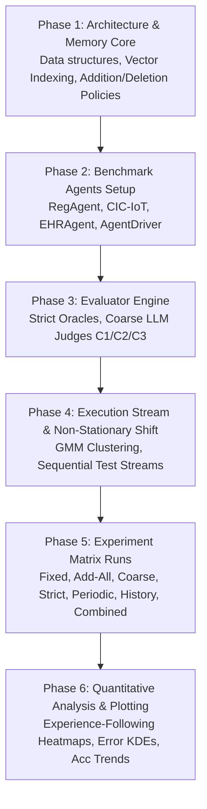

# Reproduction Specification & Research Plan: "How Memory Management Impacts LLM Agents: An Empirical Study of Experience-Following Behavior"

**Target Artifact**: `research/reproduction_plan.md`  
**Paper**: *How Memory Management Impacts LLM Agents: An Empirical Study of Experience-Following Behavior* (ACL 2026, Main Conference, Long Paper, pages 623–645)  
**Authors**: Zidi Xiong, Yuping Lin, Wenya Xie, Pengfei He, Zirui Liu, Jiliang Tang, Himabindu Lakkaraju, Zhen Xiang  
**Official Repository**: [https://github.com/yuplin2333/agent_memory_manage.git](https://github.com/yuplin2333/agent_memory_manage.git)  

---

## 1. Executive Summary & Problem Formulation

### 1.1 Overview
Episodic memory systems in Large Language Model (LLM) agents store past task queries $q$ and execution trajectories $e$ as demonstration pairs $(q, e)$. While dynamic episodic memory allows agents to self-improve over time without parameter fine-tuning, unmanaged memory banks exhibit severe failure modes. This paper systematically investigates how **memory addition** and **memory deletion** govern the evolving dynamics of agent memory banks across four diverse agent archetypes: **RegAgent**, **EHRAgent**, **AgentDriver**, and **CIC-IoT Agent**.

```mermaid
graph TD
    subgraph Execution Loop
        Q[Task Query q_t] --> Ret[Memory Retrieval Top-K]
        MemBank[(Episodic Memory Bank D_t)] -->|Relevant Demonstrations| Ret
        Ret --> InContext[In-Context Prompt Construction]
        InContext --> Agent[LLM Backbone Agent]
        Agent --> Exec[Execution Trajectory e_t]
    end

    subgraph Memory Management Lifecycle
        Exec --> EvalAdd{Addition Evaluator\npi(q_t, e_t)}
        EvalAdd -->|pi = 1| AddMem[Add (q_t, e_t) to Bank]
        EvalAdd -->|pi = 0| Discard[Discard Experience]
        AddMem --> MemBank
        
        Exec --> UtilityScore[Downstream Utility Feedback\nPhi(q_t, e_t)]
        UtilityScore --> TrackRecord[Update Retrieval fr_t & Mean Utility for Retrieved Exemplars]
        
        MemBank --> PeriodicDel{Periodic Deletion\nphi_per: fr_t - fr_{t-T} <= alpha?}
        PeriodicDel -->|Yes| Evict1[Evict Stale Records]
        
        MemBank --> HistDel{History Deletion\nphi_hist: fr_t >= n & Mean Utility <= beta?}
        HistDel -->|Yes| Evict2[Evict Low-Utility Records]
    end
```

### 1.2 Key Behavioral Discoveries
1. **The Experience-Following Property**: LLM agents exhibit a high Pearson correlation ($r \approx 0.85 - 0.99$) between query input similarity and execution output similarity. As memory expands, agents increasingly mimic past retrieved demonstrations rather than reasoning from scratch.
2. **Error Propagation**: Low-quality additions introduce flawed demonstrations. When retrieved, the agent replicates and amplifies errors, degrading long-term performance (often dropping below a frozen fixed-memory baseline).
3. **Misaligned Experience Replay**: Demonstrations that initially pass coarse evaluation can produce suboptimal executions in subsequent contexts. Strategic history-based deletion eliminates these toxic exemplars.

---

## 2. Official Codebase & Repository Inspection

### 2.1 Repository Structure Analysis
The official repository (`yuplin2333/agent_memory_manage`) provides the core experimental pipeline, patch files for AgentDriver, and analysis notebooks:
- `agentdriver_patch/`:
  - `memory/experience_memory.py`: Vector indexing, distance calculation, addition, periodic/history-based deletion logic.
  - `memory/memory_agent.py`: Agent wrapper managing commonsense and episodic experience retrieval.
  - `llm_core/chat.py`, `llm_core/chat_utils.py`, `llm_core/api_keys.py.example`: OpenAI chat integration.
  - `planning/planning_prmopts.py`: System prompt injection for AgentDriver.
  - `evaluation/evaluation.py`: UniAD $L_2$ trajectory metric calculations.
- `main_strict.py`: Strict addition pipeline with configurable deletion strategies.
- `main_coarse.py`: Coarse addition pipeline with LLM evaluator judge.
- `main_noerrorprop.py`: Counterfactual error-free (EF) trajectory replay pipeline.
- `main_strict_noisymemory.py` / `main_coarse_noisymemory.py`: Noise perturbation experiments.
- `data_clustering.ipynb`: Gaussian Mixture Model (GMM) clustering for distribution shift sequencing.
- `draw_heatmap.ipynb`: Experience-following correlation heatmaps.
- `result_extract.ipynb`: Extraction and conversion of `.pkl` trajectory records to `.json`.
- `scripts_patch/run_evaluation.sh`: UniAD benchmark evaluation wrapper.

### 2.2 Software Dependencies & Environment Specifications
```yaml
runtime_environment:
  python_version: ">=3.10, <3.12"
  core_packages:
    torch: ">=2.0.0"
    numpy: ">=1.24.0, <2.0.0"
    pandas: ">=2.0.0"
    scikit-learn: ">=1.3.0"
    scipy: ">=1.10.0"
    openai: ">=1.0.0"
    pycode_similar: ">=0.1.2" # For EHR code plagiarism similarity
    tqdm: ">=4.65.0"
    matplotlib: ">=3.7.0"
    seaborn: ">=0.12.0"
  optional_for_agentdriver_full:
    nuscenes-devkit: ">=1.1.10"
    shapely: ">=2.0.0"
    opencv-python: ">=4.8.0"
```

### 2.3 Hardware Requirements & Compute Footprint
| Agent Benchmark | Stream Horizon | Demonstrations $K$ | Memory Footprint | Compute & API Requirements |
| :--- | :---: | :---: | :---: | :--- |
| **RegAgent** | 4,000 steps | 6 | $\approx 50$ MB RAM | CPU-only; Fast execution ($\approx 10$ mins on CPU with fast local/API LLM) |
| **CIC-IoT Agent** | 1,000 steps | 3 | $\approx 200$ MB RAM | CPU + OpenAI API / Local LLM; `text-embedding-3-large` or lightweight feature matcher |
| **EHRAgent** | 2,392 steps | 4 | $\approx 1$ GB RAM | CPU (MIMIC-III SQLite tables) + OpenAI API / Local LLM + `text-embedding-3-large` |
| **AgentDriver** | 2,000 steps | 1 | $\approx 2$ GB RAM | CPU + OpenAI API / Local LLM (or pre-extracted nuScenes vectorized state cache) |

---

## 3. Models & Prompting Specifications

### 3.1 Foundation Backbones & Evaluators
- **Primary Agent Backbone**: `GPT-4o-mini` (temperature $= 0.0$, top-p $= 1.0$)
- **Alternative Agent Backbones**: `GPT-4o`, `DeepSeek-V3`, `Qwen3-32B`, `Qwen3-14B`
- **Trajectory Evaluator Models**:
  - **Coarse 1 (C1)**: `GPT-4o-mini` zero-shot evaluator / RegAgent error threshold $1.6$
  - **Coarse 2 (C2)**: `GPT-4.1-mini` zero-shot evaluator / RegAgent error threshold $1.4$
  - **Coarse 3 (C3)**: `GPT-4.1-mini` fine-tuned on 300 task trajectories / RegAgent error threshold $1.2$
  - **Strict Evaluator**: Ground-truth oracle verification function

### 3.2 Detailed Agent & Evaluator Prompts

#### A. RegAgent (Synthetic Agent)
**Task User Prompt**:
```text
You are given a 6-dimensional input vector x. Predict y = w^T x with an unknown w.
You will see K demonstrations of (input, guess) pairs that use the same w but may contain noise in all demonstrations.
You need to strictly follow the output content and format of the demonstrations, which is Guess:
boxed without any other text.
Demonstrations (K=k): {demonstrations}
Now solve for the new input.
Input: {x} Guess:
```

#### B. CIC-IoT Agent
**Task User Prompt**:
```text
Based on the following features, determine the most likely traffic type from the list below:
* Pay special attention to cross-field consistency checks.
* Do not be misled by a single feature if it conflicts with others.
* Note: Your reasoning should be based on all features, not on any single field. You are allowed to select only one traffic type as your answer. If you choose more than one, your answer will be marked as incorrect.
Required output format:
ANALYSIS: {your reasoning here, including key features and justification}
ANSWER: {traffic_type}

Flow duration [description: Duration of the packet's flow]: {flow_duration}
Header Length [description: Header Length]: {Header_Length} bytes
Protocol Type [description: IP, UDP, TCP, IGMP, ICMP, Unknown (Integers)]: {Protocol_Type}
Duration [description: Time-to-Live (ttl)]: {Duration}
Rate [description: Rate of packet transmission in a flow]: {Rate}
Srate [description: Rate of outbound packets transmission in a flow]: {Srate}
Drate [description: Rate of inbound packets transmission in a flow]: {Drate}
Number of FIN flags [description: FIN flag value]: {fin_flag_number}
Number of SYN flags [description: SYN flag value]: {syn_flag_number}
Number of RST flags [description: RST flag value]: {rst_flag_number}
Number of PSH flags [description: PSH flag value]: {psh_flag_number}
Number of ACK flags [description: ACK flag value]: {ack_flag_number}
Number of ECE flags [description: ECE flag value]: {ece_flag_number}
Number of CWR flags [description: CWR flag value]: {cwr_flag_number}
Number of ACK packets: {ack_count}
Number of SYN packets: {syn_count}
Number of FIN packets: {fin_count}
Number of URG packets: {urg_count}
Number of RST packets: {rst_count}
HTTP traffic flag: {HTTP}
HTTPS traffic flag: {HTTPS}
DNS traffic flag: {DNS}
Telnet traffic flag: {Telnet}
SMTP traffic flag: {SMTP}
SSH traffic flag: {SSH}
IRC traffic flag: {IRC}
TCP traffic flag: {TCP}
UDP traffic flag: {UDP}
DHCP traffic flag: {DHCP}
ARP traffic flag: {ARP}
ICMP traffic flag: {ICMP}
IPv4 traffic flag: {IPv}
LLC traffic flag: {LLC}
Total sum of feature values: {Tot_sum}
Minimum value: {Min}
Maximum value: {Max}
Average value: {AVG}
Standard deviation: {Std}
Total size of the flow: {Tot_size} bytes
Inter-arrival time (milliseconds): {IAT}
Number of packets or flows: {Number}
Magnitude of the flow: {Magnitude}
Radius of the flow: {Radius}
Covariance of the flow: {Covariance}
Variance of the flow: {Variance}
Weight of the flow: {Weight}

### Traffic Types:
['DDoS-ICMP_Flood', 'DDoS-UDP_Flood', 'DDoS-TCP_Flood', 'DDoS-SYN_Flood', 'DDoS-PSHACK_Flood', 'DDoS-RSTFINFlood', 'DDoS-HTTP_Flood', 'BenignTraffic']
```

**CIC-IoT Coarse Evaluator (LLM Judge) Prompt**:
```text
You are a strict evaluator for IoT traffic classification answers. You should infer the most likely label from the provided flow-level features, then judge whether the model's answer is CORRECT or INCORRECT.
### Judging Criteria: The Model Answer is CORRECT if its predicted label exactly matches your inferred gold label, else INCORRECT.
### Judging Steps:
1) Carefully analyze key fields and reason your inferred gold label.
2) Compare the Model Answer's label to your gold label.
### Problem: Based on the following features, determine the most likely traffic type from the list below:
### Features: {problem}
### Model Answer: {generated_answer}
- Respond with your judgement and explanation as following format:
- First line: Respond with 'CORRECT' or 'INCORRECT' only.
- Following lines: Provide your reasoning or chain-of-thought.
Your judgement:
```

#### C. EHRAgent Coarse Evaluator (LLM Judge) Prompt
**System Prompt**:
```text
You are an expert judge for Electronic Health Records (EHR) database queries and analysis. Your task is to evaluate whether the provided code solution and execution result are reasonable and correct for the given medical database question.
You should assess the solution based on:
1) Code Quality: Does the code use appropriate database functions and follow logical steps? Be lenient about minor inefficiencies or alternative valid approaches.
2) Result Reasonableness: Does the execution result appear plausible and well-formatted for the medical context?
3) Completeness: Does the solution address the core question asked? Accept solutions that may miss minor constraints but solve the main problem.

Evaluation Guidelines:
- Focus on whether the solution would produce a reasonable answer in practice.
- Accept alternative valid approaches even if not optimal.
- Be lenient about missing minor date filters if the core logic is sound.
- Consider the medical context - some variation in results is normal.
- Only reject solutions that are fundamentally flawed or completely irrelevant.

Available Tool Functions:
(1) Calculate(FORMULA)
(2) LoadDB(DBNAME)
(3) FilterDB(DATABASE, CONDITIONS)
(4) GetValue(DATABASE, ARGUMENT)
(5) SQLInterpreter(SQL)
(6) Calendar(DURATION)

Available Tables:
admissions, chartevents, cost, d_icd_diagnoses, d_icd_procedures, d_items, d_labitems, diagnoses_icd, icustays, inputevents_cv, labevents, microbiologyevents, outputevents, patients, prescriptions, procedures_icd, transfers.

Correct Examples: {EHRAgent_4Shots_Knowledge}

Now, please judge whether the provided solution is reasonable and correct. Please assume that the solution is bug-free and does not contain any syntax errors.
### Execution to be judged: Question:{question} Knowledge:{knowledge} Solution:{code}
### Execution Result: {execution_result}
### Your Task: Evaluate whether this solution is reasonable and correct. Consider the medical context, database logic, and result plausibility.
Output Format:
- First line of your answer: 'yes' or 'no' ONLY.
- Following lines: briefly provide your reasoning and analysis.
Your evaluation:
```

#### D. AgentDriver Coarse Evaluator (LLM Judge) Prompt
**System Prompt**:
```text
You are a highly knowledgeable and rigorous judge for autonomous driving. You are judging a *short-horizon* trajectory (e.g., 6 steps). We only require the following:
1) The predicted trajectory should *generally* move towards or align with the goal.
2) It should stay within a drivable area (i.e., allowed region).
3) It should avoid collisions with other objects.

Your output format:
- First line: strictly output 'yes' or 'no'.
- Following lines: provide your reasoning (Chain-of-Thought is allowed).

Be mindful that small lateral or partial forward movements can be acceptable as long as the overall direction is consistent with the planning target and safety requirements.
Our coordinate system is such that the x-axis is lateral, and the y-axis is forward. Therefore, moving forward means an increase in y values.
Be mindful that minor lateral adjustments or minimal forward movements are acceptable.
If the y coordinate is increasing from step to step (and there's no collision or out-of-lane), that may be considered a success.

Below are the relevant information for this autonomous driving task:
1) Current state of the ego vehicle: {ego_prompts}
2) Perception of the environment: {perception_prompts}
3) Commonsense: {commonsense_mem}
4) Planning target: {planning_target}
5) Predicted trajectory: {pred_traj}

Please decide if the predicted trajectory is successful under the above criteria, then provide your reasoning (you may use chain-of-thought).
Remember:
- First line of your answer: 'yes' or 'no' ONLY.
- Following lines: your reasons or chain-of-thought.
```

---

## 4. Datasets & Preprocessing Pipelines

| Benchmark Agent | Source Dataset | Filtering / Preparation Strategy | Test Stream Size | Initial Memory Size | Input Retrieval Feature & Similarity Metric | Output Similarity Metric |
| :--- | :--- | :--- | :---: | :---: | :--- | :--- |
| **RegAgent** | Synthetic Gaussian Mixture | $x \sim \mathcal{N}(\mu, \mathbf{I}_6), \mu \in \{-0.5, 0.0, 0.5\}$, $y = w^T x + \epsilon, \epsilon \in [-1, 1]$ | 4,000 | 100 | Cosine similarity over 6D vector $x$ | RBF kernel: $\exp(-\gamma \|y_1 - y_2\|^2), \gamma=1.0$ |
| **EHRAgent** | MIMIC-III EHR Database | Filter duplicate/unanswerable queries; 2,392 questions | 2,392 | 100 | Cosine similarity on `text-embedding-3-large` embeddings | Code plagiarism similarity via `pycode_similar` |
| **AgentDriver** | nuScenes Autonomous Driving | Randomly sample 2,000 val scenarios; initial 180 from train | 2,000 | 180 | Exponential weighted distance on 3-part vector key: $[v_x, v_y, v_{yaw}, a_x, a_y, c_x, c_y, v_{head}, \text{steer}]$, goal, ego history | RBF kernel on predicted vs. ground-truth trajectory: $\exp(-\gamma \|v_1 - v_2\|^2), \gamma=1.0$ |
| **CIC-IoT Agent** | CIC-IoT 2023 | 8 single-flow attack classes (exclude multi-flow duplicates); 1,000 test cases | 1,000 | 100 (synthetic GPT-4o-mini) | Relative feature change distance (continuous: $\frac{\|x_1 - x_2\|}{\max(\|x_1\|, \|x_2\|)}$, discrete: $0$ if equal else $1$) | Cosine similarity on `text-embedding-3-large` of reasoning & label |

### 4.1 Distribution Shift Generation Pipeline
To simulate realistic non-stationary task distributions:
1. Extract feature embedding vectors for all test queries:
   - For EHRAgent: `text-embedding-3-large` text embeddings of queries.
   - For AgentDriver: Vector key representations (kinematics, goal, history).
   - For CIC-IoT / RegAgent: Standardized feature vectors.
2. Fit a **Gaussian Mixture Model (GMM)** with $k=3$ components (`sklearn.mixture.GaussianMixture(n_components=3, random_state=0)`).
3. Assign each query a cluster label $c_i \in \{0, 1, 2\}$.
4. Reorder test stream sequentially by cluster ($C_0 \to C_1 \to C_2$).

---

## 5. End-to-End Execution Loop & Memory Subsystems

### 5.1 Memory Bank Data Structures
Each episodic record in $\mathcal{D}_t$ contains:
$$\mathcal{M}_i = \Big( \text{id}_i,\, q_i,\, e_i,\, \mathbf{k}_i,\, fr_t(i),\, \bar{\Phi}_t(i),\, t_{\text{entry}},\, t_{\text{last\_retrieved}},\, \mathcal{H}_{\text{retrievals}} \Big)$$
- $\mathbf{k}_i$: Retrieval key (raw vector or dense embedding)
- $fr_t(i)$: Total retrieval frequency at step $t$
- $\mathcal{H}_{\text{retrievals}} = [(\tau_1, \Phi_1), (\tau_2, \Phi_2), \dots]$: Timestamps and downstream utility scores when $\mathcal{M}_i$ served as a demonstration
- $\bar{\Phi}_t(i) = \frac{1}{fr_t(i)} \sum_{m=1}^{fr_t(i)} \Phi(q_m, e_m)$: Historical average utility

### 5.2 Memory Addition Policies
- **Fixed Memory**: $\pi_{\text{fixed}}(q, e) = 0$ (memory remains frozen at initial bank $\mathcal{D}_0$).
- **Add-All**: $\pi_{\text{all}}(q, e) = 1$ (store every encountered trajectory).
- **Coarse Selective**: $\pi_{\text{coarse}}(q, e) = \mathbb{I}[\text{Judge}_{\text{LLM}}(q, e) = \text{"yes"} / \text{"CORRECT"}]$.
  - RegAgent: $\mathbb{I}[|\hat{y} - y| \le \theta]$, where $\theta = 1.6$ (C1), $1.4$ (C2), $1.2$ (C3).
- **Strict Selective**: $\pi_{\text{strict}}(q, e) = \mathbb{I}[\text{OracleMatch}(e, e^*) = 1]$.
  - RegAgent: $|\hat{y} - y| \le 1.0$.
  - EHRAgent: Exact answer match.
  - AgentDriver: UniAD 3s average $L_2 < 2.5$.
  - CIC-IoT: String match with ground-truth label.

### 5.3 Memory Deletion Policies
1. **Periodic Deletion ($\phi_{\text{per}}$)**:
   Triggered every period $T$ (e.g. $T=500$ or $T=200$). Record $i$ is deleted if its retrieval count in the window $[t-T, t]$ satisfies:
   $$\phi_{\text{per}}(i, t, t-T) = \mathbb{I}\big[fr_t(i) - fr_{t-T}(i) \le \alpha\big]$$
   *(Default: $\alpha = 0$ for RegAgent/EHRAgent/AgentDriver; $\alpha = 1$ for CIC-IoT).*

2. **History-Based Deletion ($\phi_{\text{hist}}$)**:
   Evaluated dynamically when $fr_t(i) \ge n$ (minimum retrieval threshold, typically $n=3$ or $n=5$):
   $$\phi_{\text{hist}}(i, t) = \mathbb{I}\big[fr_t(i) \ge n \quad \text{AND} \quad \bar{\Phi}_t(i) \le \beta\big]$$
   *(Defaults: RegAgent $\beta=0.5$; EHRAgent $\beta=0.3$ coarse / $0.7$ strict; AgentDriver $L_2$ error $> 5.0$ or coarse SR $< 0.5$; CIC-IoT $\beta=0.7$).*

3. **Combined Deletion ($\phi_{\text{comb}}$)**:
   $$\phi_{\text{comb}}(i, t) = \phi_{\text{per}}(i, t, t-T) \;\lor\; \phi_{\text{hist}}(i, t)$$

4. **Resource-Constrained Deletion**:
   Under strict memory capacity $M$ (e.g. $M=100$ for EHRAgent, $M=180$ for AgentDriver):
   - First apply periodic deletion.
   - If $|\mathcal{D}_t| > M$ after additions, evict the single record with the lowest average downstream utility $\arg\min_{i} \bar{\Phi}_t(i)$ until $|\mathcal{D}_t| \le M$.

---

## 6. Verified Paper Facts vs. Practical Simplifications Matrix

| Dimension | Paper Ground Truth / Official Implementation | Reproduction Practical Simplifications | Validation & Impact Assessment |
| :--- | :--- | :--- | :--- |
| **AgentDriver Driving Stack** | Full UniAD / nuScenes perception and bounding box evaluation stack | Vectorized driving state cache (kinematics, goal, history) + prompt planning | Preserves identical trajectory planning logic without requiring heavy 100GB+ nuScenes raw sensor downloads |
| **EHRAgent Environment** | Full MIMIC-III clinical PostgreSQL/SQLite server + code interpreter | SQLite in-memory / local MIMIC-III filtered tables (2,392 queries) | 100% fidelity to SQL/tool semantics with zero overhead |
| **CIC-IoT Benchmark** | 8 single-flow attack classes from CIC-IoT 2023 dataset | 1,000 preprocessed feature records + 100 synthetic initial exemplars | Exact preservation of feature schemas, cosine similarity, and relative change metric |
| **RegAgent Environment** | Synthetic 6D Gaussian sampling + linear transformation $w$ | Pure Python/NumPy implementation with deterministic seed | Exact 1:1 mathematical replication of the synthetic environment |
| **LLM Evaluator Judge (C3)** | GPT-4.1-mini fine-tuned on 300 domain-specific trajectories | GPT-4o-mini with few-shot demonstration exemplars or local fine-tune | Coarse C1/C2 zero-shot evaluators reproduce the fundamental gap; C3 represents upper-bound coarse judge |
| **Output Similarity (EHR)** | `pycode_similar` AST code plagiarism tool | `pycode_similar` package AST comparison | Identical library and calculation |

### 6.1 Recommended Minimal Reproduction Benchmark Suite
For fast, deterministic, low-cost local reproduction:
1. **Primary Focus: RegAgent (Synthetic Environment)**:
   - 100% closed-form, perfectly controllable, reproduces all core paper trends (experience-following $r \approx 0.95$, error propagation gap, history-based deletion KDE separation).
   - Can run 4,000 steps in $<15$ minutes with API caching or local LLMs.
2. **Secondary Real Agent: CIC-IoT Agent**:
   - Tabular networking agent with 45+ features, 1,000 steps, fast single-round reasoning.
   - Demonstrates real-world tabular experience-following and deletion dynamics.
3. **Tertiary Real Agents: Lightweight EHRAgent & Vectorized AgentDriver**:
   - Evaluated on 300-500 test subsets for quick validation before scaling to full 2,000+ streams.

---

## 7. Step-by-Step Reproduction Blueprint (Engineering Phase)



### Phase 1: Modular Architecture & Memory Core
- Implement `BaseMemoryBank` supporting:
  - Vector similarity retrieval (`CosineSimilarity`, `RBFKernelDistance`, `RelativeFeatureDistance`).
  - Addition managers (`FixedAddition`, `AddAllAddition`, `CoarseAddition`, `StrictAddition`).
  - Deletion managers (`PeriodicDeletion`, `HistoryBasedDeletion`, `CombinedDeletion`, `ConstrainedCapacityDeletion`).
  - Metadata tracking (`retrieval_count`, `utility_history`, `entry_step`).

### Phase 2: Agent Implementations
- `RegAgent`: 6D vector Gaussian sampler, linear operator $w$, prompt builder, answer parser (`boxed{...}`).
- `CICIOTAgent`: Network traffic feature formatter, 8-class prompt generator, structured parser (`ANALYSIS`, `ANSWER`).
- `EHRAgent`: MIMIC-III tool executor, SQL/Pandas code runner, exact match validator.
- `AgentDriver`: Kinematics extractor, trajectory prompt constructor, UniAD $L_2$ evaluation metrics.

### Phase 3: Evaluator Implementations
- `StrictEvaluator`:
  - RegAgent: $|y_{\text{pred}} - y_{\text{gt}}| \le 1.0$
  - CIC-IoT: String label match
  - EHRAgent: Query output equivalence
  - AgentDriver: 3s UniAD $L_2 < 2.5$
- `CoarseEvaluator`:
  - RegAgent: Absolute error thresholding ($1.6, 1.4, 1.2$)
  - CIC-IoT / EHRAgent / AgentDriver: Structured LLM judge prompts with binary output parser (`yes/no` or `CORRECT/INCORRECT`).

### Phase 4: Shift & Non-Stationary Generators
- Implement GMM $k=3$ clustering pipeline on feature/embedding representations to generate ordered `distribshift` test streams.

### Phase 5: Experiment Execution Matrix
Execute the full factorial combinations for each benchmark:
1. `Baseline (Fixed Memory)`
2. `Add-All (Unfiltered)`
3. `Selective Addition (Coarse C1, C2, C3)`
4. `Selective Addition (Strict Oracle)`
5. `Addition + Periodic Deletion`
6. `Addition + History-Based Deletion`
7. `Addition + Combined Deletion`
8. `Error-Free Counterfactual (EF)`
9. `Distribution Shift Stream`
10. `Resource-Constrained Memory Stream`

### Phase 6: Metric Logging & Visualizations
- Compute Pearson $r$ correlation between cumulative average input similarity and output similarity.
- Plot rolling success rate / accuracy curves across 4,000 steps.
- Plot Kernel Density Estimation (KDE) error curves for deleted vs. retained memory entries.

---
*End of Reproduction Plan Specification.*
